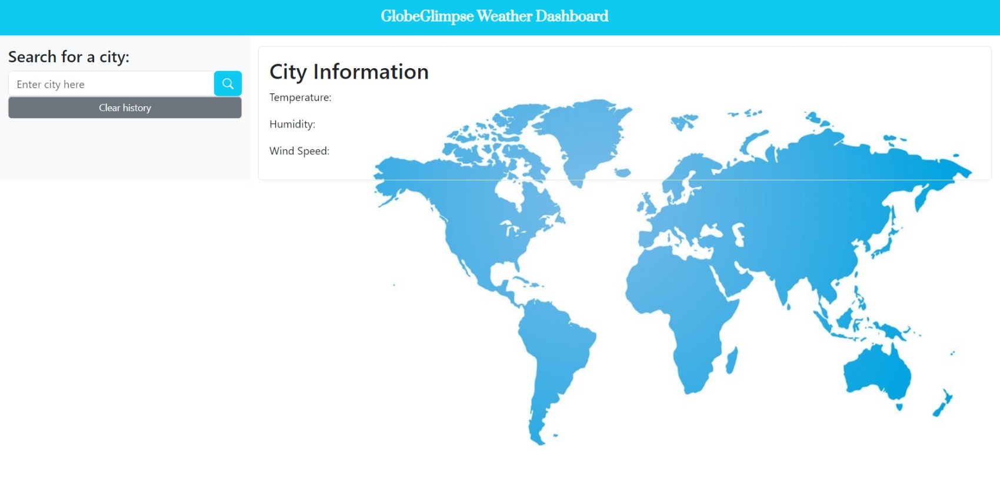
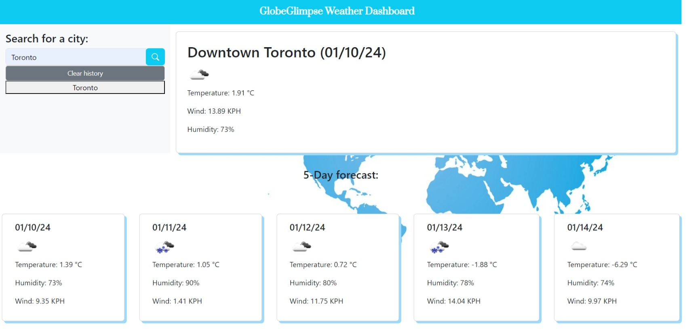
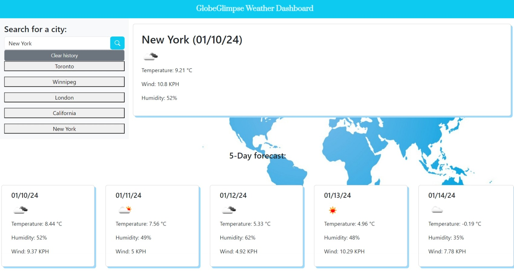
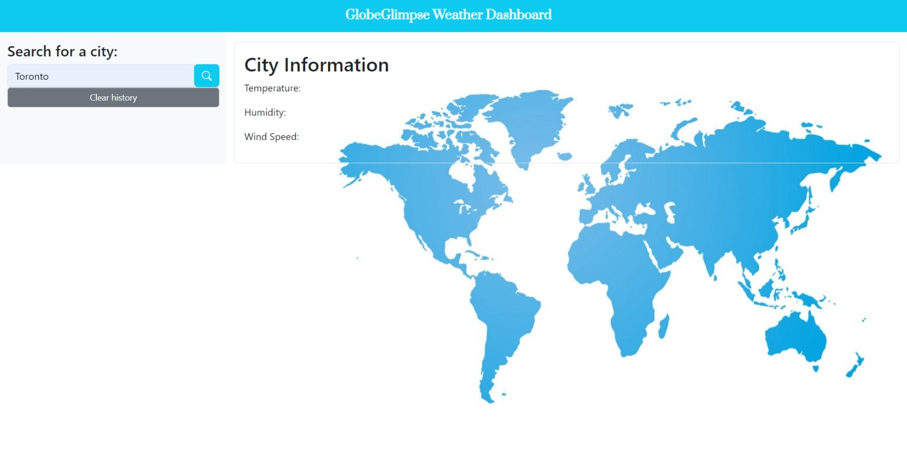

# GlobeGlimpse_Weather_Dashboard

## Description
In this week challenge #6, I introduce the GlobeGlimpse Weather Dashboard – your go-to destination for real-time weather updates in an intuitive and visually appealing format! As a transitional web developer I was tasked to craft a dynamic weather dashboard that seamlessly runs in our browser, showcasing dynamically updated HTML, CSS and JavaScript for an ideal user experience. Harnessing the power of OpenWeatherMap's 5 Day Weather Forecast API, the GlobeGlimpse Weather Dashboard fetches the latest weather data for cities across the globe. In essence, building the GlobeGlimpse Weather Dashboard is not just about weather data; it's about transforming your weather-checking routine into a visually pleasing and user-friendly experience. Embrace the power of real-time updates and explore the world's weather with ease – all from the comfort of your browser. Stay connected, stay informed, and stay ahead with GlobeGlimpse!

## Acceptance Criteria
GIVEN a weather dashboard with form inputs

WHEN I search for a city

THEN I am presented with current and future conditions for that city and that city is added to the search history

WHEN I view current weather conditions for that city

THEN I am presented with the city name, the date, an icon representation of weather conditions, the temperature, the humidity, and the wind speed

WHEN I view future weather conditions for that city

THEN I am presented with a 5-day forecast that displays the date, an icon representation of weather conditions, the temperature, the wind speed, and the humidity

WHEN I click on a city in the search history

THEN I am again presented with current and future conditions for that city

## Technologies
The technologies I used in this challenge includes:
1. HTML: template working HTML file was created that structures the basic layout of the weather dashboard including the header, aside section which includes: searchbox, search & clear history buttons. The main section includes: the current day weather as well as 5-day weather forecast. 
2. CSS: template working CSS file was created which includes the necessary styling for the weather dashboard.
3. Github: Github was used to create a repository which includes the links to the projects, assets folder, and the README file.
4. Gitlab: Gitlab was used to clone the project to our laptop.

## Installation

To install the challenge #6, first create a new repository in your GitHub account, and then clone this repository to your local computer.

To clone: git clone https://github.com/your-username/repository-name.git

## Deployment

1. Deploy your code by running "git add", "git commit", and "git push" in your local repository.

2. Visit your GitHub repository online, click 'Settings', and then select 'Pages' on the left.

3. In GitHub Pages, set the 'main' branch as the source and click 'Save'.

4. Access your live site at <your-github-username.github.io/your-repository-name>. For example, if your username is "lernantino" and your repo is "css-demo-site", the URL is <lernantino.github.io/css-demo-site>.

## Screenshot

     

   

  

  
 
## Resources
[Open Weather Map_5-Day Forecast ](https://openweathermap.org/forecast5)

[MDN web docs_Introduction to Server Side APIs](https://developer.mozilla.org/en-US/docs/Learn/Server-side/First_steps/Introduction)

## Links

[GitHub Repository link](https://github.com/MunibaP/GlobeGlimpse_Weather_Dashboard.git)

[Deployment link](https://munibap.github.io/GlobeGlimpse_Weather_Dashboard/)

## License

Redistribution of the CVW software or derived works must reproduce MITRE's copyright designation and this License in the documentation and/or other materials provided with the distribution.Copyright © 1994-1999. The MITRE Corporation (http://www.mitre.org/). All Rights Reserved.
